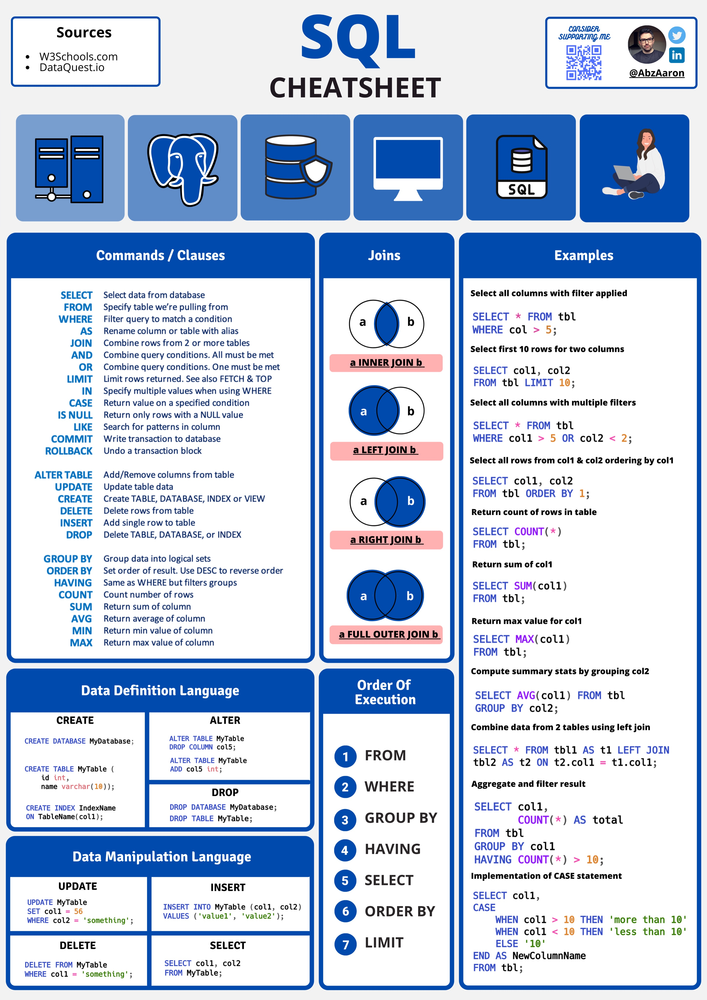

# SQL Cheat Sheet

This is a visual reference for common SQL commands and syntax.



> 📍 Located in: `sql/sql_notes_reference/SQLcheatsheet.jpg`

---

## Quick Highlights (Text Reference)

Here are some of the commands featured in the image:

```sql
-- Select all columns
SELECT * FROM table_name;

-- Filter with WHERE
SELECT * FROM employees
WHERE department = 'Sales';

-- Aggregate functions
SELECT department, COUNT(*) FROM employees
GROUP BY department;

-- Sorting
SELECT * FROM products
ORDER BY price DESC;

-- Joins
SELECT orders.id, customers.name
FROM orders
JOIN customers ON orders.customer_id = customers.id;
```

## TIME

```sql
    SELECT STRFTIME('%H:%M:%S', 'now'); -- Returns current time in HH:MM:format

    SELECT *
    FROM search_queries
    WHERE STRFTIME('%Y-%m', signup_date) = '2024-02'; --extracting year month from  format yyyy-mm-dd
```

## JOINS

```sql
SELECT COUNT(*) AS total_num_queries
FROM search_queries
INNER JOIN users ON search_queries.user_id = users.user_id
WHERE users.signup_date BETWEEN '2024-10-01' AND '2024-10-7'
```